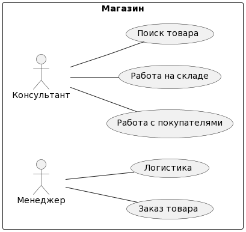

# Практика 0

Построил простейшую диаграмму на примере библиотеке. Отношение студент и библиотекаль

Диаграмма:



```()
```()
@startuml "Практическая работа 0"
left to right direction
rectangle Магазин {
Консультант -- (Работа с покупателями)
Консультант -- (Работа на складе)
Консультант -- (Поиск товара)
Менеджер-- (Заказ товара)
Менеджер-- (Логистика)
}
@enduml
```
