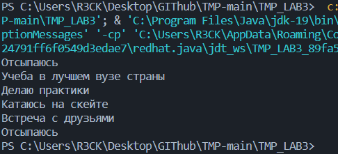
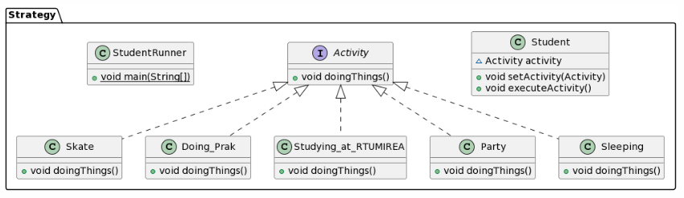
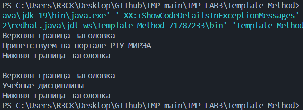
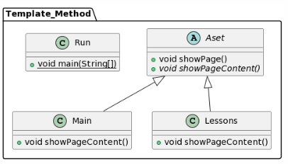

#Практика 3

##Стратегия

Создаем интерфейс Activity:

```()

package Strategy;

public interface Activity {
    public void doingThings();
}

```

Создаем класс Student:

```()

package Strategy;

public class Student {
    Activity activity;
    public void setActivity(Activity activity) {
        this.activity = activity;
    }
    public void executeActivity() {
        activity.doingThings();
    }
}

```

Создаем класс Sleeping:

```()

package Strategy;

public class Sleeping implements Activity {
    @Override
    public void doingThings(){
        System.out.println("Отсыпаюсь");
    }
}

```

Создаем класс Doing_Prak:

```()

package Strategy;

public class Doing_Prak implements Activity {
    @Override
    public void doingThings(){
        System.out.println("Делаю практики");
    }
}

```

Создаем класс Studying_at_RTUMIREA:

```()

package Strategy;

public class Studying_at_RTUMIREA implements Activity{
    @Override
    public void doingThings(){
        System.out.println("Учеба в лучшем вузе страны");
    }
}

```

Создаем класс Skate:

```()

package Strategy;

public class Skate implements Activity {
    @Override
    public void doingThings(){
        System.out.println("Катаюсь на скейте");
    }
}

```

Создаем класс Party:

```()

package Strategy;

public class Party implements Activity{
    @Override
    public void doingThings(){
        System.out.println("Встреча с друзьями");
    }
}

```

Создаем класс StudentRunner:

```()

package Strategy;

public class StudentRunner {
    public static void main(String[] args) {
        Student student = new Student();

        student.setActivity(new Sleeping());
        student.executeActivity();

        student.setActivity(new Studying_at_RTUMIREA());
        student.executeActivity();

        student.setActivity(new Doing_Prak());
        student.executeActivity();
        
        student.setActivity(new Skate());
        student.executeActivity();

        student.setActivity(new Party());
        student.executeActivity();

        student.setActivity(new Sleeping());
        student.executeActivity();
    }
}

```

Результат работы программы:



Диаграмма:

```()

@startuml
class Strategy.Student {
~ Activity activity
+ void setActivity(Activity)
+ void executeActivity()
}
class Strategy.Skate {
+ void doingThings()
}
interface Strategy.Activity {
+ void doingThings()
}
class Strategy.StudentRunner {
+ {static} void main(String[])
}
class Strategy.Doing_Prak {
+ void doingThings()
}
class Strategy.Studying_at_RTUMIREA {
+ void doingThings()
}
class Strategy.Party {
+ void doingThings()
}
class Strategy.Sleeping {
+ void doingThings()
}


Strategy.Activity <|.. Strategy.Skate
Strategy.Activity <|.. Strategy.Doing_Prak
Strategy.Activity <|.. Strategy.Studying_at_RTUMIREA
Strategy.Activity <|.. Strategy.Party
Strategy.Activity <|.. Strategy.Sleeping
@enduml

```



##Шаблонный метод (Template Method)

Создаем класс WelcomePage:

```()
package Template_Method;

public class Main extends Aset{
    @Override
    public void showPageContent(){
        System.out.println("Приветствуем на портале РТУ МИРЭА");
    }
}

```

Создаем класс NewsPage:

```()
package Template_Method;

public class Lessons extends Aset {
    @Override
    public void showPageContent(){
        System.out.println("Учебные дисциплины");
    }
}

```

Создаем абстрактный класс WebsiteTemplate:

```()

package Template_Method;

public abstract class Aset {
    public void showPage() {
        System.out.println("Верхняя граница заголовка");
        showPageContent();
        System.out.println("Нижняя граница заголовка");
    }
    public abstract void showPageContent();

}

```

Создаем класс WebsiteRunner:

```()
package Template_Method;

public class Run {
    public static void main(String[] args) {
        Aset welcomePage = new Main();
        Aset newsPage = new Lessons();

        welcomePage.showPage();

        System.out.println("--------------------");

        newsPage.showPage();

    }
}

```

Результат работы программы:



Диаграмма:

```()
@startuml
abstract class Template_Method.Aset {
+ void showPage()
+ {abstract}void showPageContent()
}
class Template_Method.Run {
+ {static} void main(String[])
}
class Template_Method.Main {
+ void showPageContent()
}
class Template_Method.Lessons {
+ void showPageContent()
}


Template_Method.Aset <|-- Template_Method.Main
Template_Method.Aset <|-- Template_Method.Lessons
@enduml
```


